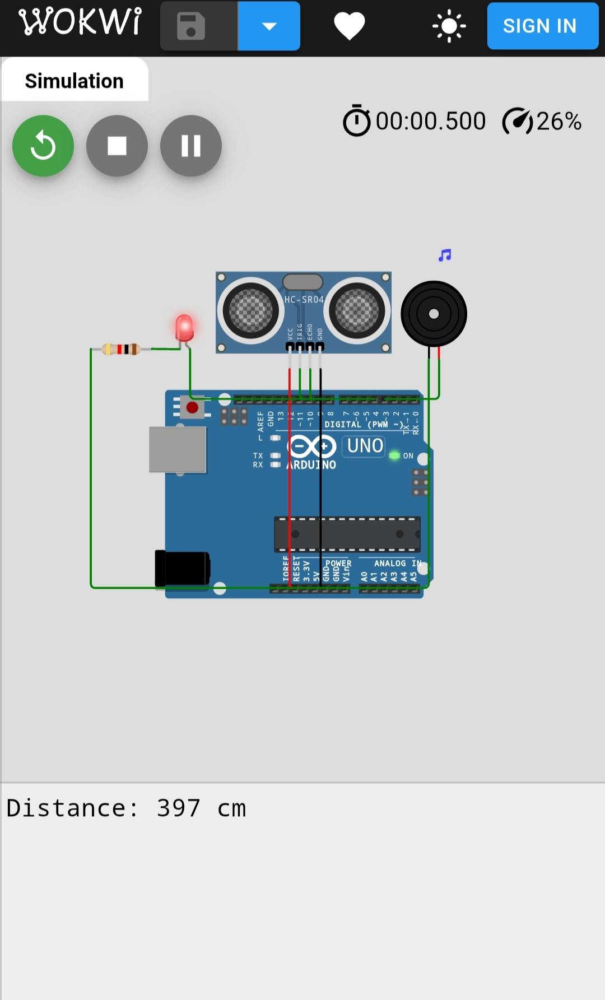

# Water-level-detection-and-alert-system-
An Arduino-based Water Level Detection and Alert System using an HC-SR04 ultrasonic sensor. Alerts with LED and buzzer when the tank is nearly full. Simulated on Wokwi.
## ⚙️ Components Used
- Arduino Uno  
- HC-SR04 Ultrasonic Sensor  
- Buzzer  
- LED + 1kΩ Resistor  
- Jumper Wires  
## 💻 Code
See the Arduino code in [`water_level.ino`](water_level_detection_and_alert_system.ino).

## ▶️ Simulation
Run the project on **Wokwi**:  
👉 [Click here to simulate](https://wokwi.com/projects/441423467596955649)  

## 📷 Circuit Diagram

